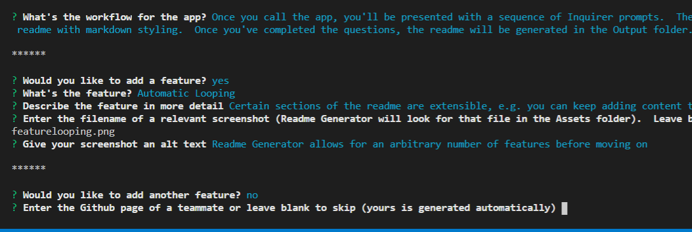

# Readme Butler


## Table of Contents
* [Description](#description)
* [Installation](#installation)
* [Usage](#usage)
* [Credits](#credits)
* [License](#license)

## Description

Writing readmes is repetitive and boring.  So I made a script to do it for you!

## Installation

Readme Butler can be installed by entering the following command in the app's directory:
```
npm install
```

This should install the necessary npm packages and allow the app to run.

## Usage

Readme Butler expects your github username and the repo as arguments, e.g.:

```
> node readmeButler.js nvanbaak readme-butler
```

Once you call the app, you'll be presented with a sequence of Inquirer prompts.  The app takes your answers to generate a readme with markdown styling.  The readme will generate inside the current folder once the questions are answered.

### Automatic Looping

Certain sections of the readme are extensible, e.g. you can keep adding content until you say you're done.



## Credits

* Created by https://github.com/nvanbaak/

## Planned Features:

* The ability to add third-party resources to the Credits section
* An automatic Planned Features section

## License

This project uses the GNU license.

------
© 2020 Nik Van Baak